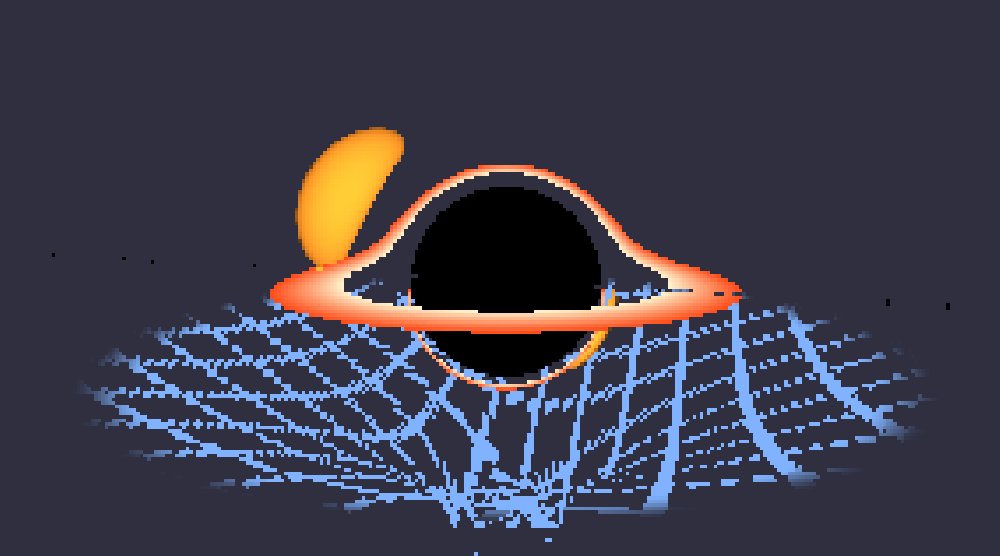

# Black Pixhole

<!-- PROJECT LOGO -->
<!--
 

  

  <h3 align="center">Best-README-Template</h3>

  

	An awesome README template to jumpstart your projects!
	 
	<a href="https://github.com/othneildrew/Best-README-Template"><strong>Explore the docs »</strong></a>
	 
	 
	<a href="https://github.com/othneildrew/Best-README-Template">View Demo</a>
	&middot;
	<a href="https://github.com/othneildrew/Best-README-Template/issues/new?labels=bug&template=bug-report---.md">Report Bug</a>
	&middot;
	<a href="https://github.com/othneildrew/Best-README-Template/issues/new?labels=enhancement&template=feature-request---.md">Request Feature</a>
  

-->

<!-- TABLE OF CONTENTS -->

  
Table of Contents

  <ol>
	<li><a href="#about-the-project">About The Project</a></li>
	<li><a href="#built-with">Built With</a></li>
	<li><a href="#play">How to play?</a></li>
	<li><a href="#roadmap">Roadmap</a></li>
	<li><a href="#license">License</a></li>
	<li><a href="#contact">Contact</a></li>
	<li><a href="#acknowledgments">Acknowledgments</a></li>
  </ol>

<!-- ABOUT THE PROJECT -->
## About The Project

### Overall
Built for Siege Week 10, for the 'Space' theme. As space as it gets, right? This one was so much more shader than I expected, and yet I want to try and expose a bunch of shader parameters. Unless someone shows me an easy way to give someone access to a number with godot UI though, I'll just stick with nothing for now. *sigh* Oh well. I could make this bigger or add this in somewhere or make this my wallpaper though... Wait... If I optimize this?? Someone please help that would be awesome.

### What even is this?
A black hole simulation to rival Interstellar!!! No, its a realtime black hole raytracer with an accretion disk, a star, and a grid to show the bending of spacetime. May your computer live to see another day.
* Left click to drag camera around black hole
* Scroll to zoom around the black hole

### What do I take out of this?
Math. Physics. Fragment shaders. I hate that I had to have such long conversations with ai to understand any of this... But I mostly understand it now?? Also how to work with fragment shaders! Fun!

(<a href="#readme-top">back to top</a>)

### Screenshots
Might be big, so click to reveal!

  
<strong>Main image</strong>

  

> [!TIP]
> Scroll! Look around! Have fun! Not a lot happens sooo...

(<a href="#readme-top">back to top</a>)

### Built With

* [![Godot][Godot 4.4]][Godot-url]
<!--
* [![Next][Next.js]][Next-url]
* [![React][React.js]][React-url]
* [![Vue][Vue.js]][Vue-url]
* [![Angular][Angular.io]][Angular-url]
* [![Svelte][Svelte.dev]][Svelte-url]
* [![Laravel][Laravel.com]][Laravel-url]
* [![Bootstrap][Bootstrap.com]][Bootstrap-url]
* [![JQuery][JQuery.com]][JQuery-url]-->

(<a href="#readme-top">back to top</a>)

### Play

If you still insist on building this unoptimized mess, go ahead. Oh, but the release version is [here](https://pixelsaver.github.io/black-pixhole/)

1. Install Godot 4.5
2. Download and unzip the code
3. Open the file with Godot project manager
4. Go to Project > Export, add whichever platform you're on (MacOS, Windows) and then click export.
5. You're good to go!

#### Tutorial
* Left click and drag to pan camera around the black hole
* Scroll to zoom closer and farther

(<a href="#readme-top">back to top</a>)

<!-- ROADMAP -->
## Roadmap
- [X] Simulate the black hole
  - [X] Raytracing?
  - [X] Render accretion disk
  - [ ] Stars in the background
  - [X] Spherical star to show gravitaitonal lensing
  - [ ] Simulation interactivity, time step, pause, etc
  - [ ] Post processing (bloom etc)
  - [X] Put a grid under it to show a point of non-moving
- [X] Make it interactible, move the camera around using mouse position

(<a href="#readme-top">back to top</a>)

<!-- LICENSE -->
## License

Distributed under the MIT License. See `LICENSE` for more information.

(<a href="#readme-top">back to top</a>)

<!-- CONTACT -->
## Contact

Pixel Saver - [itch.io](https://pixelsaver.itch.io/)

Project Link: [https://github.com/PixelSaver/PlacePixels](https://github.com/PixelSaver/PlacePixels)

(<a href="#readme-top">back to top</a>)

<!-- ACKNOWLEDGMENTS -->
## Acknowledgments

* Many thanks for both the inspiration and the code from [@kavan010](https://github.com/kavan010/black_hole/)'s amazing black hole C++ simulation. Couldn't have done it without you.