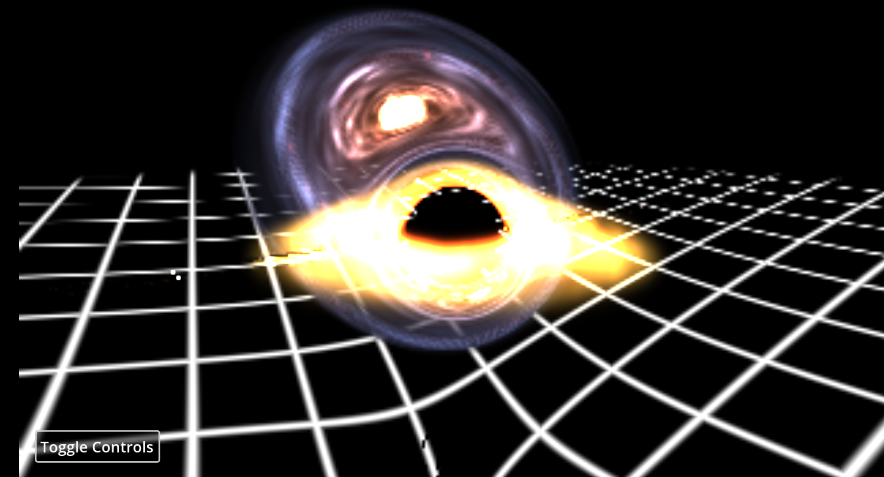
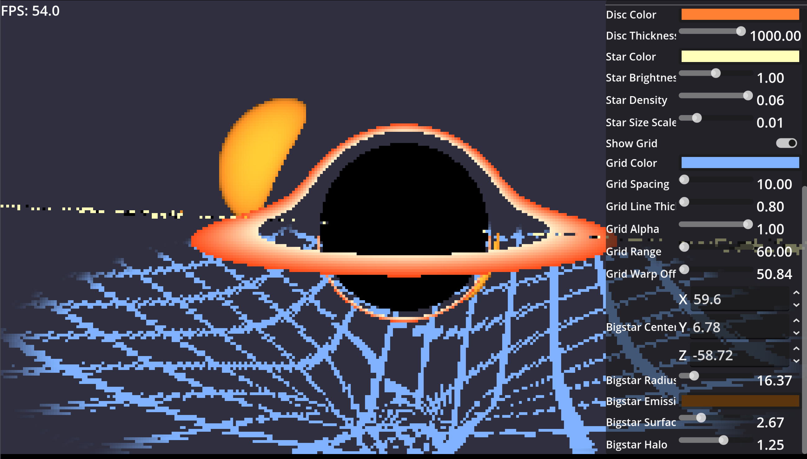

# Black Pixhole

<!-- PROJECT LOGO -->
<!--
 

  

  <h3 align="center">Best-README-Template</h3>

  

	An awesome README template to jumpstart your projects!
	 
	<a href="https://github.com/othneildrew/Best-README-Template"><strong>Explore the docs »</strong></a>
	 
	 
	<a href="https://github.com/othneildrew/Best-README-Template">View Demo</a>
	&middot;
	<a href="https://github.com/othneildrew/Best-README-Template/issues/new?labels=bug&template=bug-report---.md">Report Bug</a>
	&middot;
	<a href="https://github.com/othneildrew/Best-README-Template/issues/new?labels=enhancement&template=feature-request---.md">Request Feature</a>
  

-->

<!-- TABLE OF CONTENTS -->

  
Table of Contents

  <ol>
	<li><a href="#about-the-project">About The Project</a></li>
	<li><a href="#built-with">Built With</a></li>
	<li><a href="#play">How to play?</a></li>
	<li><a href="#roadmap">Roadmap</a></li>
	<li><a href="#license">License</a></li>
	<li><a href="#contact">Contact</a></li>
	<li><a href="#acknowledgments">Acknowledgments</a></li>
  </ol>

<!-- ABOUT THE PROJECT -->
## About The Project

### Overall
Built for Siege Week 10, for the 'Space' theme. As space as it gets, right? This one was so much more shader than I expected, and yet I want to try and expose a bunch of shader parameters. Unless someone shows me an easy way to give someone access to a number with godot UI though, I'll just stick with nothing for now. *sigh* Oh well. I could make this bigger or add this in somewhere or make this my wallpaper though... Wait... If I optimize this?? Someone please help that would be awesome.

From Siege W14 (THE LAST ONE) I turned the web version into a compute shader, and upped the capabilities of the shader because of it. I will keep the github pages version up if you still want to, but if this github repo doesn't get starred I won't work on either the web or the compute shader version. AKA If you like it, STAR!! Thanks for visiting!

### What even is this?
A black hole simulation to rival Interstellar!!! No, its a realtime black hole raytracer with a volumetric accretion disk, a volumetric galaxy, and a grid to show the bending of spacetime. May your computer live to see another day.
* Left click to drag camera around black hole
* Scroll to zoom around the black hole
* Edit the parameters of the shader by yourself! Click and drag or edit the values directly
* Space to pause the game
* C to hide controls and take screenshots!!

### What do I take out of this?
Math. Physics. Fragment shaders. I hate that I had to have such long conversations with ai to understand any of this... But I mostly understand it now?? Also how to work with fragment shaders! Fun! Also, I finally made a simulation editor, which makes making simulators much easier... :) 

From my second round of development on this project... I have a love hate relationship with compute shaders and Godot. It works so much faster, but the process is so weird and finnicky... The shader setup node is so large just to get the compute shader running haha. Actually, I still havent gotten sampler3D's figured out, hence why I have a 3D Noise function in my code.

(<a href="#readme-top">back to top</a>)

### Screenshots
Might be big, so click to reveal!

https://github.com/user-attachments/assets/d83324ab-b0da-42ed-bd7a-6b702747f7df

  
<strong>Screenshot of the compute shader</strong>

  

  
<strong>The github pages version</strong>

  

  
<strong>Controls for the github pages version</strong>

  

> [!TIP]
> Change the camera_target value to change where the camera is looking!

(<a href="#readme-top">back to top</a>)

### Built With

* [Godot](https://godotengine.org)
<!--
* [![Next][Next.js]][Next-url]
* [![React][React.js]][React-url]
* [![Vue][Vue.js]][Vue-url]
* [![Angular][Angular.io]][Angular-url]
* [![Svelte][Svelte.dev]][Svelte-url]
* [![Laravel][Laravel.com]][Laravel-url]
* [![Bootstrap][Bootstrap.com]][Bootstrap-url]
* [![JQuery][JQuery.com]][JQuery-url]-->

(<a href="#readme-top">back to top</a>)

### Play

If you still insist on building this unoptimized mess, go ahead. Oh, but the release (web) version is [here](https://pixelsaver.github.io/black-pixhole/). For the newer, compute version, check the [releases tab](https://github.com/PixelSaver/black-pixhole/releases)

1. Install Godot 4.5
2. Download and unzip the code
3. Open the file with Godot project manager
4. Go to Project > Export, add whichever platform you're on (MacOS, Windows) and then click export.
5. You're good to go!

#### Tutorial
* Left click and drag to pan camera around the black hole
* Scroll to zoom closer and farther
* Shift to pause
* Click and drag values, or edit them directly
* Click toggle controls to toggle the control visibility

(<a href="#readme-top">back to top</a>)

<!-- ROADMAP -->
## Roadmap
- [X] Simulate the black hole
  - [X] Raytracing?
  - [X] Render accretion disk
  - [x] Stars in the background
  - [X] Spherical star to show gravitaitonal lensing
  - [x] Simulation interactivity, time step, pause, etc
  - [X] Add a volumetric galaxy 
  - [X] Put a grid under it to show a point of non-moving
- [X] Make it interactible, move the camera around using mouse position
  - [X] Edit the simulation yourself using the access to the simulator
  - [ ] Turn the editor runtime_inspector class into a gdextension maybe?
- [ ] Post processing (bloom etc)
- [ ] Add physics movement of planets
- [ ] Two black holes 0.0
### Notes
Since this is running on a compute shader, it doesn't work on web. I'm pissed too, but maybe one day I'll turn it into a spatial shader or something.

(<a href="#readme-top">back to top</a>)

<!-- LICENSE -->
## License

Distributed under the MIT License. See `LICENSE` for more information.

(<a href="#readme-top">back to top</a>)

<!-- CONTACT -->
## Contact

Pixel Saver - [itch.io](https://pixelsaver.itch.io/)

Project Link: [https://github.com/PixelSaver/PlacePixels](https://github.com/PixelSaver/PlacePixels)

(<a href="#readme-top">back to top</a>)

<!-- ACKNOWLEDGMENTS -->
## Acknowledgments

* Many thanks for both the inspiration and the code from [@kavan010](https://github.com/kavan010/black_hole/)'s amazing black hole C++ simulation. Couldn't have done it without you.
* https://godotshaders.com/shader/black-hole-shader/ by [TheOxideGamer](https://godotshaders.com/author/theoxidegamer/)
* Random guy on the internet for their simplex noise function. Here's [their reddit post](https://www.reddit.com/r/proceduralgeneration/comments/gc39q8/3d_cubic_noise_in_glsl_a_very_simple_random_noise/)
